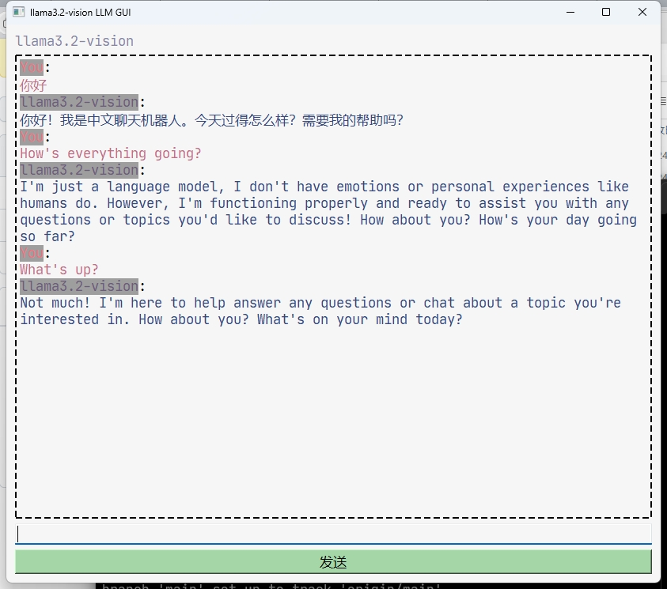

# Llama-GUI
## Introduction

Recently, I was playing Ollama, and I found that the dialogue of the console was very rough, so I used Python as a simple front-end, and according to the official documentation, I called the API, which can distinguish the dialogue, and it is also more convenient (maybe)

## How to use?

* First download Ollama on your computer if you don't have one, then use `Ollama pull <model name>` to download the model you want to deploy, then enter Ollama serve to start the service, in my program, there is a variable called **model_name**, you need to change it to the name of the model you downloaded, <u>otherwise it won't work!</u>
* For Python, you need to download PyQt5 via pip and requests, or install dependencies directly with `pip install -r ./requirements.txt`

## Presentation

